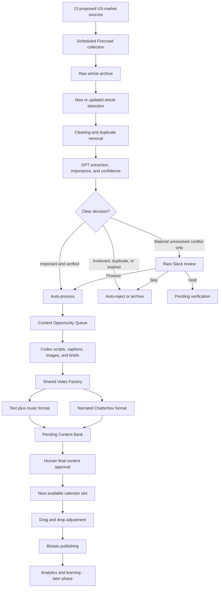
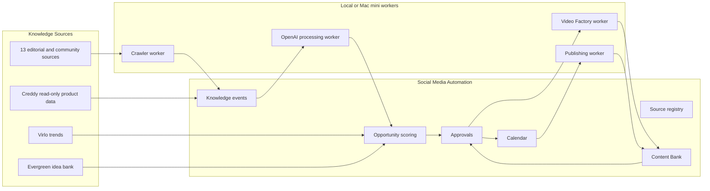
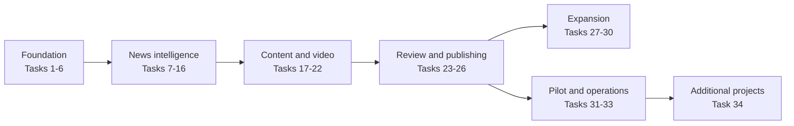

# Social Media Content OS and Shared Video Factory

## Master Implementation Plan

**Initial product:** Creddy
**Future projects:** MinuteWise, Roast AI, and additional campaigns
**Document type:** Engineering and product implementation specification
**Status:** Approved foundation implementation in progress; production Creddy pipeline remains disabled
**Last updated:** 19 August 2026

---

## 1. Purpose of This Document

This document converts the complete Creddy content discussion and the existing Social Media Automation and Video Factory systems into an implementation plan that can be followed one task at a time.

It serves four purposes:

1. Preserve the boss's intended operating model in clear language.
2. Define all 34 implementation tasks and their dependencies.
3. Give engineering a stable reference for database, backend, UI, worker, approval, scheduling, publishing, and deployment work.
4. Prevent implementation from moving to the next task before the current task has code, tests, documentation, and acceptance approval.

This is a planning document, not executable code. API-key names are documented, but real secret values must never be added here or committed to Git.

### 1.1 Repository audit and implementation status

The implementation audit completed on 19 August 2026 covered all three codebases.

| Codebase | Confirmed architecture | Integration decision |
|---|---|---|
| Social Media Automation | TypeScript workers plus a Next.js 16/Supabase dashboard; existing MinuteWise/Roast AI flows; campaign-aware files and database rows | Preserve `main.ts`, current schedulers, posting, analytics, and campaign data. Add Creddy as an isolated pipeline behind `CREDDY_PIPELINE_ENABLED=false` until the dry-run gate passes. |
| Video Factory | Local Flask queue using JSON job files, Chatterbox, FFmpeg, HyperFrames, and three render threads | Reuse through an adapter first. Later replace local JSON durability with Social Automation job state without rewriting the rendering pipeline prematurely. |
| Creddy | iOS, Android, admin CMS, website, and Supabase catalog. The supplied anon key can read only RLS-permitted public catalog data. | Social Automation remains read-only. Current app deep links do not support canonical news or public benefit-detail destinations, so MVP CTA fallback is `creddy://home` until additive mobile routes ship. |

The live Social Automation database already contains the Creddy campaign as `credit-card-rewards`. This exact slug must be reused; a duplicate `creddy` campaign must not be created.

The isolated Creddy pipeline is now implemented under `scripts/creddy/`:

- All thirteen boss-approved sources enabled for twice-daily shadow ingestion.
- Four Firecrawl topic searches.
- Eight OR filter keywords with context protection for broad `status` and `tools` matches.
- Fail-closed runtime configuration and disabled-by-default feature flag.
- Configuration validation and automated foundation tests.
- Firecrawl v2 client with URL-only search followed by selective page scraping.
- Conservative URL normalization, SHA-256 content identity, title fingerprints,
  and deterministic new/unchanged/changed classification.
- An additive, unapplied private Supabase migration covering sources, fetch
  runs, raw snapshots, canonical events, evidence links, and rare review cases.
- Database-enforced campaign isolation and the exact rare Slack-review safety
  predicate.
- File-first raw, filtered, canonical, analysis, content, video, approval,
  schedule, and published stores in the dedicated data project.
- Strict importance/confidence routing, Codex analysis/content task prompts,
  signed Slack Process/Skip/Hold handling, and idempotent Slack receipts.
- Shared Video Factory support for narrated and licensed text-plus-music modes.
- A project-specific Creddy Content Bank with authenticated video previews,
  revision requests, destination selection, and human schedule approval.
- Blotato submission/reconciliation that accepts only approved scheduled files.
- Eight timezone-anchored, paused Codex schedule proposals with independent
  retry boundaries for collection through publishing.

The schema and incremental-storage design are documented in
`docs/creddy-ingestion-schema.md`. Existing generation, posting, analytics, and
MinuteWise/Roast AI entrypoints were not changed. The additive migration has not
been applied and the feature flag remains off pending activation inputs.

---

## 2. Confirmed Product Direction

### 2.1 Creddy scope

- Creddy targets the **United States market only**.
- Content language is US English and monetary values use USD.
- All thirteen boss-approved sources are monitored through the source registry.
- The existing Instagram account will be used.
- A TikTok account still needs to be created and connected.
- Creddy is an app-first product available on iOS and Android.
- Social CTAs should open the relevant Creddy app screen through deep links.
- If the app is not installed, the link should fall back to the App Store or Google Play.
- Creddy initially needs two video formats: text plus music, and narrated video.
- These are formats, not necessarily separate brand accounts.

### 2.2 Content direction

- Target three primary content pieces per day after calibration.
- Slot A covers actionable current opportunities.
- Slot B covers education and understanding.
- Slot C covers decisions, comparisons, discovery, and discussion.
- Direct product-led content should be approximately 10% of output.
- Product-assisted content can demonstrate Creddy while still providing independent value.
- One verified knowledge event should be reusable across several content formats.

### 2.3 Automation direction

- The system should automatically process clearly important, verified news.
- It should automatically reject clear noise, irrelevant content, and duplicates.
- Slack review must be rare and used only for unresolved, material factual conflicts.
- Generated content always enters a pending Content Bank before publishing.
- Final approval can assign the next available calendar slot automatically.
- Users must be able to drag and drop calendar items.
- Blotato remains the initial publishing provider.
- Social analytics through Apify is a later phase after publishing begins.

### 2.4 Infrastructure direction

- Development starts locally.
- Production workers will later run on the office Mac mini.
- Creddy orchestration uses separate project-scoped Codex Scheduled Tasks so
  every stage has an independent retry boundary. Collection runs twice daily;
  render polling and approved publishing checks run more frequently. The Mac
  and desktop app must stay running.
- GPT analysis and supported image-generation work run inside the scheduled
  Codex task and consume Codex/ChatGPT plan usage or workspace credits, not
  OpenAI API Platform billing. Usage is not assumed to be free or unlimited.
- The local data project is the MVP source of truth and durable job queue.
  Supabase mirroring remains an additive deployment option after its migration
  and service credential are approved.

---

## 3. Boss's Intended Operating Model

The following diagram is an implementation interpretation of the boss's stated point of view.



### 3.1 Manual-work principle

The objective is not to send a large percentage of articles to Slack. Slack exists only to prevent a rare but important unresolved conflict from being published incorrectly. The desired operating pattern is automatic processing on most days and perhaps one Slack exception every few days.

### 3.2 Two approval levels

1. **News-selection exception approval:** Slack decides whether an uncertain, materially conflicting event should proceed to content production.
2. **Final content approval:** The dashboard checks the finished script, visuals, audio, CTA, source, and schedule before publication.

Slack approval never publishes content directly.

### 3.3 Boss requirements mapped to implementation tasks

| Boss's requirement | Implementation response | Tasks |
|---|---|---:|
| Crawl the supplied news websites once or twice daily and fetch only new material | Source registry, scheduler, Firecrawl, raw archive, and incremental cursors | 5-9 |
| Remove duplicate/noisy articles and rank what matters | Deterministic cleaning, canonical events, extraction, importance and confidence scoring | 10-13 |
| Keep manual news review extremely low | Automatic verification first; Slack only for material unresolved conflicts | 12-15 |
| Produce Instagram/TikTok, newsletter, and YouTube-ready content | Opportunity queue and multi-format content packages; longer products phased later | 16-18, 27 |
| Create text/music and voice-over videos | Shared Video Factory with two Creddy templates using Chatterbox and HyperFrames | 19-22 |
| Put finished posts into a pending queue for approval | Content Bank with revisions and final content approval | 23-24 |
| Automatically fill the next slots, but allow drag and drop | Slot-aware calendar and rescheduling controls | 25 |
| Publish after approval | Idempotent Blotato scheduling and status reconciliation | 26 |
| Notify Creddy users without unsafe database access | Read-only product access plus a narrow Creddy-owned notification endpoint | 28 |
| Learn from published content later using Apify | Deferred metric collection and governed performance recommendations | 29-30 |
| Develop locally, then move scheduled workers to the office Mac mini | End-to-end pilot, operational controls, and supervised deployment | 31-33 |
| Reuse the system for MinuteWise, Roast AI, and more | Campaign-scoped architecture, templates, accounts, permissions, and budgets | 3, 22, 32, 34 |

---

## 4. End-to-End System Map



---

## 5. Implementation Method

Every task follows the same completion gate:

1. Confirm unresolved business decisions.
2. Define schema and interfaces.
3. Implement backend/database code.
4. Implement dashboard UI where required.
5. Add unit, integration, and failure-path tests.
6. Run a local manual verification.
7. Update technical documentation.
8. Obtain task acceptance before starting dependent work.

Tasks may be prepared in parallel only when they do not share schema or behavior. Production publishing must remain disabled until the pilot task passes.

---

# Milestone 1 - Requirements and Foundation

## Task 1 - Finalize the Creddy MVP Scope

### Objective

Freeze the first release boundary so implementation does not expand into every possible channel at once.

### Confirmed scope

- US-only market and US English.
- All thirteen boss-approved editorial, product-reference, and community sources enabled through the source registry.
- Existing Instagram account.
- TikTok account to be created.
- Creddy app is the primary destination.
- Text/music and narrated short-form video formats.
- Rare Slack exception approval.
- Final approval in the Content Bank.
- Automatic next-slot scheduling with drag-and-drop adjustment.
- Blotato publishing.
- Local pilot first, Mac mini deployment later.

### Recommended MVP exclusions

- Automated long-form YouTube publication.
- Automated newsletters and email delivery.
- Push-notification delivery.
- Automated blog publication.
- Apify performance analytics.
- MinuteWise and Roast AI production enablement.

The architecture must support these later, but they should not delay the first Creddy publishing loop.

### Inputs required

- Thirteen source URLs and their approved sections, crawl rules, and reuse constraints.
- Existing Instagram handle and Blotato mapping.
- Proposed TikTok handle and account ownership.
- iOS App Store URL.
- Google Play URL.
- App deep-link domain or chosen link architecture.
- US publishing timezone, recommended `America/New_York` unless management chooses otherwise.
- Confirmation that two outputs are formats on the official platform accounts rather than separate Creddy brands.

### Deliverables

- Approved MVP scope record.
- Project profile for Creddy.
- Platform/account inventory.
- Inputs and credentials checklist.
- Explicit list of deferred capabilities.

### Acceptance criteria

- Every feature is classified as MVP, later, or excluded.
- The US market rule is unambiguous.
- Instagram ownership is verified.
- TikTok creation is assigned.
- App destinations and store fallbacks are documented.
- No dependent task relies on an undefined platform or market.

---

## Task 2 - Define the Improved Creddy Content Strategy

### Objective

Create a structured Content OS rather than a static list of unrelated post ideas.

### Audience segments

1. New cardholders.
2. Rewards optimizers.
3. Frequent travelers.
4. Premium-card holders.
5. Deal seekers.
6. Existing Creddy users.

Each content item must target one primary segment and may tag secondary segments.

### Daily slots

#### Slot A - Act Now

Answers: What should a user do, and by when?

Fallback order when no breaking news exists:

1. Expiring opportunity.
2. Deal of the week.
3. Benefit reminder.
4. Scheduled evergreen opportunity.

Weak news must not be published only to fill the slot.

#### Slot B - Understand

Explains what something is, why it matters, how it works, when to use it, and what mistake to avoid.

#### Slot C - Decide or Discuss

Supports comparisons, calculations, scenarios, quizzes, opinions, and product-assisted demonstrations.

### Promotion mix

- 70% value-only content.
- 20% product-assisted content.
- 10% directly product-led content.

All content may carry light Creddy branding, but a hard product pitch should remain limited.

### Content taxonomy

#### Topic pillars

- Cards.
- Points currencies.
- Airline programmes.
- Hotel programmes.
- Benefits and credits.
- Redemptions.
- Travel protections.
- Loyalty status.
- Creddy product and data.

#### Event types

- New launch.
- Bonus increase.
- Transfer bonus.
- Status match.
- Benefit change.
- Expiry.
- Devaluation.
- Fee change.
- Partnership.
- Discontinuation.

#### Content approaches

- Explanation.
- Comparison.
- Calculation.
- Warning.
- Tutorial.
- Ranking.
- Scenario.
- Opinion.
- Quiz.
- Product demonstration.

This matrix produces the 15 pillars x 20 repeatable concepts without making the idea bank unstructured.

### Initial franchises

- Creddy Daily.
- Benefit You Forgot.
- Points School.
- Worth the Fee?
- Would You Transfer?
- Creddy Weekly.

Later franchises include Redemption Challenge, Wallet Audit, Points Mythbusters, What's 100K Worth?, Keep/Cancel/Downgrade, State of Points, and Creddy Data.

### App-first CTA levels

- Engagement CTA: save, share, or comment.
- Product-assisted CTA: open the relevant Creddy feature.
- Product CTA: download or open Creddy.

Each content record stores `destination_screen`, `deep_link_url`, and iOS/Android fallback URLs.

### Calendar guardrails

- Do not repeat the same story without a material update.
- Limit repeated coverage of the same card or issuer.
- Avoid repeated hooks and identical formats.
- Balance beginner, intermediate, and advanced content.
- Enforce the direct-product ratio.
- Revalidate time-sensitive facts before publication.
- Allow urgent Slot A content to replace only the appropriate slot.

### Success metrics by slot

| Slot | Primary outcomes |
|---|---|
| Act Now | Saves, follows, app opens, timely actions |
| Understand | Saves, completion, search discovery |
| Decide or Discuss | Shares, comments, profile visits |
| Product-led | Deep-link opens, installs, registrations |

### Deliverables

- Audience and taxonomy configuration.
- Approved content-mix rules.
- Initial franchise definitions.
- Content-record schema.
- CTA and deep-link mapping rules.
- Calendar guardrails.
- A later deliverable containing 300 tagged concepts.

### Acceptance criteria

- Every proposed content item can be tagged by audience, topic, event, approach, slot, format, promotion level, and app destination.
- Slot fallback behavior is defined.
- Product promotion has an enforceable maximum.
- Metrics reflect the purpose of each slot.

---

## Task 3 - Implement the Multi-Project Architecture

### Objective

Use one shared platform for Creddy, MinuteWise, Roast AI, and future projects without mixing their data or duplicating the application.

### Core rules

- Every shared record contains `campaign_id`.
- Every asset path is campaign-scoped.
- Every job loads a project configuration before processing.
- Every publishing account belongs to one campaign.
- A post can publish only when its campaign matches the account campaign.
- Text/music and narrated outputs are formats under Creddy, not separate projects.

### Shared services

- Next.js dashboard.
- Supabase database and storage.
- Job framework.
- Codex Scheduled Task orchestration, with an optional OpenAI API fallback adapter.
- Video Factory workers.
- Content Bank and calendar.
- Blotato adapter.
- Monitoring and audit framework.

### Project-specific configuration

- Market, language, and timezone.
- Brand assets and tone.
- Sources and content taxonomy.
- Prompts and model selection.
- Voice and template pack.
- Platform accounts.
- Approval rules.
- Deep links and CTAs.
- Automation flags and cost limits.

### Recommended dashboard tabs

1. Overview.
2. Content OS.
3. Sources.
4. Opportunities.
5. Video Factory.
6. Content Bank.
7. Approvals.
8. Calendar.
9. Published.
10. Analytics.
11. Settings.

Tabs may be controlled by project feature flags.

### Project onboarding flow

1. Basic identity and market.
2. Brand assets and tone.
3. Content strategy.
4. Video/voice configuration.
5. Social-account mapping.
6. Approval and automation settings.
7. Test render and test publish.
8. Explicit activation.

### Roles

- Administrator.
- Project manager.
- Reviewer.
- Editor.
- Viewer.

### Failure and cost isolation

- One campaign failure must not stop another campaign.
- Every project has daily/monthly budgets and job limits.
- Urgent Creddy news can receive priority without starving other queues.
- New projects remain publishing-disabled until a test succeeds.

### Deliverables

- Campaign configuration schema.
- Campaign-scoped database rules and storage paths.
- Project navigation and feature flags.
- Account-matching safeguards.
- Role and project-access policy.
- Per-project usage limits.

### Acceptance criteria

- Automated tests demonstrate that Creddy cannot access or publish MinuteWise/Roast AI records.
- A new project can be configured without copying application code.
- Workers load the correct project brand, voice, template, account, and budget.
- A campaign can be paused independently.

---

## Task 4 - Configure Environment Variables and Provider Access

### Objective

Define secrets, ownership, environments, and provider responsibilities without exposing keys.

### Existing or expected shared variables

```env
# Creddy AI/orchestration (default; uses Codex/ChatGPT usage)
CREDDY_AI_EXECUTION_MODE=codex_scheduled

# Optional API fallback only
OPENAI_API_KEY=

# News crawling
FIRECRAWL_API_KEY=

# Social Automation Supabase
NEXT_PUBLIC_SUPABASE_URL=
NEXT_PUBLIC_SUPABASE_ANON_KEY=
SUPABASE_SERVICE_ROLE_KEY=

# Slack exception decisions
SLACK_BOT_TOKEN=
SLACK_SIGNING_SECRET=
SLACK_APPROVAL_CHANNEL_ID=
DASHBOARD_BASE_URL=

# File-first stage store and local render dependencies
CREDDY_DATA_ROOT=
VIDEO_FACTORY_BASE_URL=
CREDDY_BACKGROUND_MUSIC_PATH=

# Existing publishing and research
BLOTATO_API_KEY=
VIRLO_API_KEY=

# Optional read-only Creddy product data
CREDDY_SUPABASE_URL=
CREDDY_SUPABASE_ANON_KEY=
```

### Deferred analytics variables

```env
ANALYTICS_PROVIDER=apify
APIFY_API_TOKEN=
APIFY_INSTAGRAM_ACTOR_ID=
APIFY_TIKTOK_ACTOR_ID=
APIFY_YOUTUBE_ACTOR_ID=
```

### No-key local tools

- Chatterbox.
- HyperFrames.
- FFmpeg.

### Security requirements

- Never expose service-role or provider keys to browser code.
- Never prefix a server secret with `NEXT_PUBLIC_`.
- Use separate development, staging, and production keys.
- Use a dedicated OpenAI project so usage can be monitored.
- Give Social Automation only read-only Creddy access.
- Do not use a Creddy service-role key in the Social Automation project.
- Rotate any secret shared through an insecure channel.
- Store secrets in a local secret file for development and a managed secret mechanism for deployment.

### Provider boundaries

| Provider | Responsibility |
|---|---|
| Firecrawl | External news-page extraction |
| OpenAI | Classification, structured extraction, scoring support, scripts, and images |
| Supabase | State, storage, jobs, approvals, and calendar |
| Slack | Rare material-conflict decisions |
| Blotato | Publishing to connected accounts |
| Virlo | Optional trend signal |
| Apify | Later social-performance collection |

### Acceptance criteria

- A key inventory names the owner and environment of every secret.
- Application startup validates required variables without logging their values.
- Browser bundles contain no server keys.
- Provider failures are reported without printing credentials.

---

# Milestone 2 - News Collection

## Task 5 - Configure the Thirteen Sources and Topic Searches

### Objective

Create a controlled source registry so all thirteen sources can be monitored without crawling unrelated pages or treating community discussion as verified fact.

### Proposed source registry

| Source | URL | Initial class | Initial use |
|---|---|---|---|
| 10xTravel | `https://10xtravel.com/` | Specialist publication | Discovery and secondary confirmation |
| AwardWallet Blog | `https://awardwallet.com/blog/` | Specialist publication | Discovery and secondary confirmation |
| Doctor of Credit | `https://www.doctorofcredit.com/` | Specialist publication | Offers, program changes, and secondary confirmation |
| FlyerTalk | `https://www.flyertalk.com/forum/` | Community forum | Early signal and discussion only |
| Frequent Miler | `https://frequentmiler.com/` | Specialist publication | Discovery and secondary confirmation |
| MilesTalk | `https://milestalk.com/` | Specialist publication | Discovery and secondary confirmation |
| One Mile at a Time | `https://onemileatatime.com/` | Specialist publication | Discovery and secondary confirmation |
| r/awardtravel | `https://www.reddit.com/r/awardtravel/` | Community forum | Early signal and audience questions only |
| r/churning | `https://www.reddit.com/r/churning/` | Community forum | Early signal and audience questions only |
| Rove Miles | `https://www.rovemiles.com/` | Product/reference site | Tool, redemption, and product discovery |
| The Points Guy | `https://thepointsguy.com/` | Specialist publication | Discovery and secondary confirmation |
| Upgraded Points | `https://upgradedpoints.com/` | Specialist publication | Discovery and secondary confirmation |
| View from the Wing | `https://viewfromthewing.com/` | Specialist publication | Discovery and secondary confirmation |

These are proposed inputs, not primary authorities. Material values should be verified against issuer, airline, hotel, loyalty-program, regulator, or other official sources whenever available.

All thirteen boss-approved sources run twice daily during shadow ingestion. Tier
and factual-use rules remain mandatory: specialist publications support
discovery/confirmation, product references support discovery, and FlyerTalk plus
the two Reddit communities are signal-only and never sufficient as sole factual
confirmation.

### Firecrawl topic searches

Run the following configured discovery searches in addition to direct source monitoring:

- `airline status`
- `hotel status`
- `points devaluation`
- `points sweet spot`

Search results pass through the same URL normalization, incremental detection, deduplication, US-market relevance, and verification pipeline as direct-source articles.

### Keyword qualification

The configured filter keywords are:

- `transfer bonus`
- `award chart`
- `devaluation`
- `redemption`
- `program change`
- `sweet spot`
- `status`
- `tools`

The eight keywords use **OR logic**: matching any one keyword satisfies the keyword gate. Matching a keyword does not by itself make an article important or publishable. The article must still pass US-market relevance, freshness, duplication, verification, and scoring rules. Broad terms such as `status` and `tools` must be evaluated in the travel-rewards context to prevent unrelated content from entering the pipeline.

### Source metadata

- Name and domain.
- Base/start URLs.
- Include and exclude paths.
- RSS or sitemap URLs when available.
- Source tier.
- Expected categories.
- Crawl frequency.
- Market applicability.
- Robots/licensing notes.
- Reliability and priority.
- Last successful crawl.

### Source tiers

- **Tier A:** Official issuer, airline, hotel, or loyalty source. Used as primary evidence.
- **Tier B:** Trusted specialist publication. Used for discovery and confirmation.
- **Tier C:** Secondary blog, product/reference site, or aggregator. Used for discovery; material claims require confirmation.
- **Tier D:** Community content such as Reddit and FlyerTalk. Used as an early signal, question source, or sentiment input; never treated as sole factual confirmation.

### Calibration

All thirteen sources and the four searches run in seven-day shadow mode before automatic content production. Measure article volume, duplicate rate, relevance, extraction failures, false keyword matches, and per-source cost. Adjust include/exclude paths and community-thread rules rather than accepting uncontrolled volume.

### Acceptance criteria

- All thirteen sources and four searches have approved configurations.
- The crawler does not traverse unrelated site sections.
- Tier and market rules are recorded.
- Keyword OR behavior is covered by tests, including contextual handling for `status` and `tools`.
- Shadow-mode reporting identifies noisy or unreliable sources.

---

## Task 6 - Build the Codex Scheduled Orchestrator

### Objective

Run the pipeline reliably locally and later on the Mac mini.

### Initial schedules

- One morning Creddy cycle.
- One evening Creddy cycle.
- Manual Run Now.
- Scheduled content planning.
- Render-worker polling/claiming.
- Publishing checks.
- Retry/recovery jobs.

Exact times are stored using a named US timezone and converted safely to UTC.

### Implementation requirements

- Store durable pipeline state, locks, and run history in Supabase; the Codex
  schedule itself is managed in the desktop app's **Scheduled** section.
- Run one standalone local-project task twice daily so dependent stages execute
  sequentially against the same durable state.
- Keep the Mac mini powered on, the desktop app running, and the saved Social
  Media Automation project available at its configured path.
- Add distributed locks so a job cannot run twice.
- Store run start/end, status, counts, and errors.
- Support pause/resume per campaign.
- Catch up safely after downtime without duplicating work.
- Provide Manual Run Now with permission checks.

### Important boundary

Scheduled Codex runs replace the required OpenAI API model call, but do not
replace Firecrawl, Supabase, Slack, Blotato, or other provider credentials. They
consume Codex/ChatGPT usage under the signed-in plan and remain subject to plan,
workspace, model, sandbox, and network limits. Multiple dependent schedules are
avoided because they can overlap or race; one idempotent orchestrator advances
the complete cycle and stops at human final approval.

### Acceptance criteria

- Duplicate scheduler invocations result in one effective run.
- A missed run is visible and recoverable.
- Creddy can be paused without pausing MinuteWise.
- Timezone and daylight-saving behavior are tested.

---

## Task 7 - Implement Firecrawl Ingestion

### Objective

Discover and extract relevant pages from configured sources while preserving provenance.

### Processing sequence

1. Load active source configuration.
2. Discover URLs from RSS, sitemap, or allowed listing pages.
3. Apply include/exclude rules before scraping.
4. Submit allowed URLs to Firecrawl.
5. Request clean Markdown/structured output and metadata.
6. Store the raw response and request metadata.
7. Record per-page success, failure, duration, and credit usage where available.
8. Retry only transient failures with backoff.

### Safety and quality

- Respect approved crawling rules and reasonable concurrency.
- Do not use private/authenticated content without authorization.
- Preserve the canonical source URL.
- Do not present scraped wording as Creddy-authored text.
- Treat scraped content as evidence/input, not final publishable copy.

### Acceptance criteria

- A test source produces raw stored articles with source metadata.
- Invalid/unapproved paths are never scraped.
- A failed page does not fail the whole source run.
- Rate-limit and provider errors retry safely.

---

## Task 8 - Implement Raw and Structured Storage

### Objective

Keep immutable raw evidence and normalized searchable records.

### Storage paths

```text
campaigns/{campaign_id}/research/raw/{date}/{run_id}/
campaigns/{campaign_id}/research/processed/{date}/
campaigns/{campaign_id}/media/images/
campaigns/{campaign_id}/media/audio/
campaigns/{campaign_id}/media/videos/
```

### Core records

- `sources`.
- `crawl_runs`.
- `source_documents`.
- `article_versions`.
- `knowledge_events`.
- `knowledge_sources`.
- `processing_errors`.

### Requirements

- Raw documents are versioned and never silently overwritten.
- Normalized records reference the raw object and source URL.
- Content hashes detect changes.
- Storage retention is configurable.
- Campaign-level access policies prevent cross-project reads.

### Acceptance criteria

- Any published claim can be traced back to a raw source version.
- Re-scraping creates a version when content changes.
- Storage paths cannot escape the campaign prefix.

---

## Task 9 - Implement Incremental Article Detection

### Objective

Process only new or materially updated information.

### Comparison keys

- Canonical URL.
- Published and updated timestamps.
- Content hash.
- Title similarity.
- First/last seen times.
- Existing canonical knowledge event.

### Behavior

- New URL: create new source document.
- Same URL, unchanged hash: mark seen; do not reprocess.
- Same URL, changed content: create version and determine material change.
- Different URL, same story: pass to semantic deduplication.
- Removed page: preserve existing evidence and mark unavailable.
- Recent articles: recheck for 24-48 hours because terms may change.

### Acceptance criteria

- Repeated crawls do not create duplicate articles.
- Material changes re-enter verification.
- Cosmetic HTML changes do not create new opportunities.

---

# Milestone 3 - Article Intelligence

## Task 10 - Implement Cleaning and Deduplication

### Objective

Reduce bulk content before expensive AI analysis and content production.

### Deterministic cleaning

- Remove navigation, cookie text, ads, and repeated boilerplate.
- Normalize canonical URLs and tracking parameters.
- Reject excluded paths and unsupported content types.
- Normalize dates, issuer/programme names, and whitespace.
- Match exact hashes and near-identical text.

### Semantic deduplication

- Compare titles, entities, event type, dates, and claim values.
- Cluster several articles reporting the same event.
- Choose a canonical event while preserving every supporting source.
- Treat a materially changed bonus, expiry, or eligibility term as an update rather than a duplicate.

### Rejection versus reuse

An article rejected as current news may still support evergreen education. Rejection codes should include duplicate, wrong market, irrelevant, expired, low-quality, insufficient value, and unsupported claim.

### Acceptance criteria

- Multiple reports of one event create one knowledge event.
- All supporting sources remain attached.
- Duplicate volume is measured per source.
- No raw record is destroyed by deduplication.

---

## Task 11 - Implement Structured Information Extraction

### Objective

Convert article text into a predictable event schema that can be verified and reused.

### Required extracted fields

- Headline and short summary.
- Event type and topic.
- Cards, issuers, airlines, hotels, and programmes affected.
- Country and currency.
- Offer value, bonus ratio, annual fee, or benefit value.
- Eligibility and targeting.
- Published, updated, valid-from, and expiry dates.
- Required user action.
- Audience segments.
- Potential app destination.
- Candidate content formats.
- Claim list with source references.

### Implementation approach

- Use the Codex scheduled orchestrator with a strict structured-output schema;
  retain the OpenAI API adapter only as an optional future fallback.
- Keep deterministic parsers for obvious dates and URLs.
- Reject schema-invalid responses and retry safely.
- Record model, prompt version, token usage, and output version.
- Do not allow the model to invent missing terms; unknown values remain null and are flagged.

### Acceptance criteria

- Representative articles produce schema-valid events.
- Every material extracted claim points to evidence.
- Missing values are represented as missing, not guessed.
- US/non-US applicability is tested.

---

## Task 12 - Implement Verification and Conflict Detection

### Objective

Resolve uncertainty automatically before considering human review.

### Automatic verification sequence

1. Prefer Tier A/official evidence.
2. Compare independent approved sources.
3. Compare publication and update timestamps.
4. Re-scrape inaccessible or possibly stale pages.
5. Compare claim-by-claim values.
6. Run a second independent AI verification pass.
7. Determine whether any remaining conflict is material.

### Material facts

- Bonus amount.
- Transfer ratio.
- Expiry date.
- Annual fee.
- Eligibility/targeting.
- Affected card or programme.
- Country availability.
- Whether the offer is public or targeted.

A wording difference that does not change the recommendation is not material.

### Acceptance criteria

- Agreement and conflict are recorded per claim.
- Newer official information supersedes older secondary reporting.
- A failed verification does not silently become approved.
- Non-material wording differences do not create Slack alerts.

---

## Task 13 - Implement Importance, Confidence, and Routing

### Objective

Make automated decisions while keeping human-review volume extremely low.

### Importance score

| Criterion | Weight |
|---|---:|
| Actionability | 20 |
| Financial impact | 20 |
| US audience reach | 15 |
| Urgency | 15 |
| Creddy relevance | 10 |
| Novelty | 10 |
| Content potential | 10 |

### Confidence score

| Criterion | Weight |
|---|---:|
| Primary/official source | 30 |
| Independent confirmation | 20 |
| Source agreement | 15 |
| Complete terms and dates | 15 |
| Freshness | 10 |
| Extraction quality | 10 |

### Starting thresholds

- Importance 70-100: high.
- Importance 45-69: medium.
- Importance 0-44: low.
- Confidence 80-100: high.
- Confidence 60-79: medium.
- Confidence 0-59: low.

Thresholds must be configurable and calibrated during shadow mode.

### Hard rejection rules

- Non-US-only event with no US-user impact.
- Exact or semantic duplicate with no material update.
- Expired before useful publication.
- Irrelevant business/general news.
- Unsupported rumour or low-quality affiliate copy.
- No meaningful user value or action.
- Recently covered without a new development.

### Routing

| Importance | Confidence | Route |
|---|---|---|
| High | High | Auto-process |
| High | Medium | Re-scrape and reverify |
| High | Low with material unresolved conflict | Rare Slack review |
| Medium | High | Evergreen/weekly queue |
| Medium | Medium | Defer or archive |
| Low | Any | Archive/reject |

### Exact Slack condition

```text
importance >= configured_high_threshold
AND material_conflict = true
AND automated_verification_exhausted = true
AND conflict_changes_messaging = true
```

Low confidence alone must never send an item to Slack.

### Acceptance criteria

- A labeled test set produces explainable routes.
- Every decision stores component scores and reason codes.
- Slack volume during calibration is demonstrably rare.
- Rejected records are archived, not deleted.

---

# Milestone 4 - Slack Exception Decisions

## Task 14 - Implement the Slack Approval Application

### Objective

Allow a reviewer to resolve rare material conflicts without opening the dashboard.

### Slack message content

- Headline and source links.
- Short summary.
- Conflicting claims side by side.
- Importance, urgency, and confidence.
- Affected cards/programmes.
- Why automated verification stopped.
- Suggested content formats.

### Actions

- **Process:** release to the opportunity queue.
- **Skip:** archive with reviewer and reason.
- **Hold:** keep pending for more evidence.
- **Choose Formats:** permit selected output formats.

### Backend flow

1. Create an `approval_request` record.
2. Post a Block Kit message through the Slack bot.
3. Store Slack channel/message identifiers.
4. Receive the signed interaction callback.
5. Acknowledge quickly and process asynchronously.
6. Update the Supabase state machine.
7. Update the Slack message with the decision.

### Acceptance criteria

- All actions update the correct event.
- Unauthorized or malformed actions fail safely.
- The dashboard shows the same decision state as Slack.
- Slack failure leaves the item accessible in the dashboard.

---

## Task 15 - Implement Slack Safety, Audit, and Low-Volume Controls

### Objective

Make Slack reliable, secure, idempotent, and intentionally quiet.

### Requirements

- Verify Slack signatures and request timestamps.
- Restrict decisions to approved users or user groups.
- Make every action idempotent.
- Record reviewer, timestamp, action, optional reason, and previous state.
- Prevent an old Slack message from changing an already completed event.
- Send a reminder or grouped digest instead of repeated individual alerts.
- Never auto-approve due to timeout.
- Track Slack review rate as a percentage of processed events.
- Alert administrators if review volume exceeds the configured expectation.

### Acceptance criteria

- Repeated button clicks create one downstream job.
- Forged/expired callbacks are rejected.
- Unanswered items remain pending.
- Audit history is immutable and queryable.
- Calibration shows that only material conflicts reach Slack.

---

# Milestone 5 - Content Planning and Generation

## Task 16 - Implement the Content Opportunity Queue

### Objective

Combine dynamic events and evergreen concepts into an explainable daily plan.

### Opportunity fields

- Campaign.
- Canonical knowledge event or evergreen concept.
- Slot eligibility.
- Importance and content-value score.
- Deadline/expiry.
- Target audience.
- Pillar, event type, and franchise.
- Promotion level.
- Candidate formats.
- App destination.
- Coverage history.
- State and priority.

### Daily selection

- Slot A selects the highest-value actionable current opportunity.
- Slot B selects the next eligible educational concept.
- Slot C selects a decision/discussion, product-assisted, community, or data-led item.
- A breaking opportunity may replace Slot A but not silently remove approved content; displaced content returns to the queue.
- Selection must honor repetition, audience, issuer, difficulty, and promotion guardrails.

### Acceptance criteria

- The system can explain why each slot was selected.
- No expired event is selected.
- The promotional ratio and repetition rules are enforced.
- Displaced content is preserved and reschedulable.

---

## Task 17 - Implement Codex-Scheduled Content Generation

### Objective

Replace the exhausted Gemini-dependent Creddy path with project-scoped Codex
Scheduled Tasks for unattended processing, without requiring an OpenAI API key.

### Provider abstraction

- `CREDDY_AI_EXECUTION_MODE=codex_scheduled` chooses the default Creddy mode.
- `openai_api` remains an explicit optional fallback mode and requires
  `OPENAI_API_KEY` only when selected.
- Common interfaces return validated structured data.
- Prompts are versioned per project and operation.
- A future provider can be added without rewriting the pipeline.
- Existing Gemini integration may remain only as an optional fallback after output compatibility is tested.

### Generated package

- Hook and platform variants.
- Script.
- Caption and hashtags.
- CTA and app destination.
- On-screen text.
- Shot list.
- Image prompts.
- Source/citation list.
- Explicit factual claims requiring final review.
- Newsletter/blog/notification variants when enabled.

### Cost and reliability

- Use a cost-efficient model for bulk extraction/classification.
- Use a stronger configured model only for difficult verification or final synthesis.
- Cache repeatable outputs where safe.
- Store token usage and estimated/actual cost where available.
- Enforce timeouts, retries, schema validation, and output-length limits.
- Track Codex task usage and keep prompts/artifacts compact; scheduling does not
  make model work free or unlimited.

### Acceptance criteria

- Generated output validates against the content-package schema.
- Scripts cite the canonical event and do not invent missing values.
- Provider errors are retryable and observable.
- Cost is attributable to the campaign and operation.

---

## Task 18 - Implement Image and Visual Asset Generation

### Objective

Generate brand-safe visual inputs for videos without coupling the pipeline to one image provider.

### Requirements

- Create a visual-provider interface so GPT Image or another approved provider can be selected by configuration.
- Convert the content package into structured visual prompts containing subject, composition, aspect ratio, safe areas, brand palette, and prohibited elements.
- Support generated images, licensed/source-provided media, reusable Creddy brand assets, charts, icons, and text-only fallbacks.
- Store the provider, prompt version, dimensions, cost, generation status, and usage rights with every asset.
- Validate that a generated image does not display fabricated card designs, issuer logos, benefit values, or financial claims.
- Create a retry path and a deterministic fallback template when generation fails or is rejected.

### Deliverables

- Visual-provider adapter and configuration.
- Prompt schemas and Creddy visual guidelines.
- Asset metadata and storage records.
- Preview, approve, reject, and regenerate actions.

### Acceptance criteria

- A content opportunity can produce all required 9:16 visual assets.
- Failed generation does not block the pipeline permanently.
- Every visual is traceable to its source or generation prompt.
- Text remains readable inside platform-safe areas.

---

## Task 19 - Convert Video Factory into a Durable Worker

### Objective

Reuse the current Video Factory capabilities as a production rendering service for every project in Social Media Automation.

### Required changes

- Move job state from local/in-memory behavior to the shared Supabase-backed job model.
- Accept a versioned render manifest instead of UI-specific input.
- Support queued, preparing, rendering, uploading, completed, failed, cancelled, and retrying states.
- Add progress, structured logs, attempt count, heartbeat, timeout, cancellation, retry, and restart recovery.
- Upload outputs and intermediate assets to configured object storage.
- Make renders idempotent using the campaign, content package, template version, format, and revision.
- Keep Chatterbox, HyperFrames, FFmpeg, captioning, music mixing, and composition behind adapters.
- Run as a worker process locally first and later as a supervised process on the Mac mini.

### Render manifest

Each job must include:

- `campaign_id`, `content_package_id`, and `render_job_id`.
- Template and version.
- Format, platform, aspect ratio, duration, and frame rate.
- Script, timed text, scene plan, asset references, music, and voice configuration.
- CTA and end-card destination.
- Output and quality settings.

### Acceptance criteria

- A stopped worker can resume or safely retry unfinished jobs.
- Duplicate requests do not produce duplicate published assets.
- Every render has logs, provenance, project ownership, and a preview URL.
- One project's failure cannot block another project's queue.

---

## Task 20 - Build Creddy Format A: Animated Text and Music

### Objective

Create the fast, high-volume Creddy format requested by the boss: animated text, supporting visuals, and background music without narration.

### Template behavior

- Use a strong hook in the opening frames.
- Present one fact or action per scene with short animated text.
- Include source/date context where it materially affects the claim.
- Use a consistent Creddy palette, typography, transitions, logo treatment, and end card.
- Use licensed music with platform-safe volume and loop behavior.
- End with the correct app-first CTA and deep-link destination.
- Export platform-specific variants rather than assuming one file fits every platform.

### Quality rules

- Text must remain readable on a phone and inside Instagram/TikTok safe zones.
- No scene may depend on audio for comprehension.
- Numbers, dates, fees, and ratios must match the verified event record.
- The default duration and density must be configurable by template version.

### Acceptance criteria

- A verified event renders a complete text/music video automatically.
- The video passes automated duration, resolution, audio, and safe-area checks.
- A reviewer can trace every factual statement to a source.

---

## Task 21 - Build Creddy Format B: Narrated Video

### Objective

Create the second Creddy format using narration, synchronized captions, and richer scene composition.

### Template behavior

- Generate narration from the approved script through Chatterbox.
- Generate or assemble scenes through HyperFrames and the Video Factory composition layer.
- Produce word- or phrase-level caption timing.
- Normalize narration and mix background music below it.
- Use natural pauses around important values and calls to action.
- Render an app-first end card that matches the selected deep link.

### Reliability and quality

- Maintain a project-specific voice profile and pronunciation dictionary for issuer, airline, hotel, and card names.
- Detect missing audio, clipping, silence, caption overflow, duration mismatch, and desynchronization.
- Allow a reviewer to edit pronunciation or script and rerender only the affected revision.
- Do not create a separate social account merely because the content has narration; account mapping remains configurable.

### Acceptance criteria

- Narration, captions, and scenes remain synchronized.
- Proper nouns pass the pronunciation checklist.
- The output is understandable with and without sound.
- Rerendering creates a new revision while preserving the prior artifact.

---

## Task 22 - Build the Multi-Project Template System

### Objective

Allow Creddy, MinuteWise, Roast AI, and future projects to use the same rendering engine without sharing brand-specific configuration accidentally.

### Template model

- Templates belong to a project or are explicitly marked shared.
- Each template has versions, supported platforms, required inputs, default duration, safe areas, fonts, colors, voice, music policy, CTA component, and output settings.
- A published version is immutable; edits create a new version.
- The selected version is stored on every render and published asset.
- Project feature flags decide which formats and providers are available.

### Dashboard behavior

- Project selector scopes all template lists and preview data.
- Admins can clone a shared template into a project and customize it.
- Reviewers can preview templates with sample data before activation.
- Missing fonts/assets fail validation before a production job begins.

### Acceptance criteria

- The same worker renders different brands without cross-project assets or settings.
- Existing renders remain reproducible after a template is updated.
- A new project can be added through configuration plus approved templates rather than a new application fork.

---

## Task 23 - Build the Pending Content Bank

### Objective

Create the central queue where generated content waits for human review before scheduling.

### Required views and actions

- Filter by project, platform, format, status, content slot, pillar, source, risk, and date.
- Show script, caption, CTA, visual assets, video preview, sources, scores, conflicts, and generation history together.
- Support edit, comment, regenerate, duplicate, compare revisions, approve, reject, hold, and archive.
- Preserve immutable revision history and identify who changed what and when.
- Group multiple platform assets derived from the same canonical event.
- Surface expired or materially changed source information before approval.

### Status model

`draft -> generating -> pending_review -> changes_requested -> approved -> scheduled -> published`

Terminal or side states include `rejected`, `expired`, `failed`, and `archived`.

### Acceptance criteria

- A reviewer can understand and approve an item from one screen.
- An approved revision cannot be silently changed afterward.
- A changed approved item returns to review unless the change is explicitly classified as non-material.
- Every action is recorded in the audit log.

---

## Task 24 - Implement Final Content Approval

### Objective

Keep the boss's final approval step for generated posts while avoiding approval overload during news filtering.

### Approval rules

- Slack is only for exceptional unresolved news conflicts before content generation.
- The Content Bank is the normal approval location for completed content assets.
- Reviewers verify factual accuracy, source freshness, brand voice, visual quality, CTA destination, rights, and platform policy.
- Approval is revision-specific and platform-specific.
- Rejection requires a reason; requested changes return to the correct generation/editing stage.
- Permissions enforce who can approve, edit, schedule, or publish.

### Expiry protection

- Time-sensitive items have a factual expiry and a publish-by time.
- Sources are rechecked before scheduling or publishing when the configured freshness window has passed.
- Changed material facts invalidate approval automatically.

### Acceptance criteria

- Only an authorized user can move content into the scheduling queue.
- Approval records include reviewer, timestamp, revision, checklist results, and source snapshot.
- Expired content cannot be scheduled or published.

---

## Task 25 - Build the Content Calendar and Slot Engine

### Objective

Schedule approved assets into the next suitable slots and let the team adjust the plan visually.

### Calendar behavior

- Provide day, week, and month views scoped by project and account.
- Automatically place approved content in the next eligible slot.
- Support drag-and-drop rescheduling with validation.
- Display Slot A (Act Now), Slot B (Understand), and Slot C (Decide/Discuss).
- Prevent account collisions, expired scheduling, missing approval, and invalid platform timing.
- Preserve displaced content when breaking news takes a slot.
- Support blackout dates, frequency limits, minimum spacing, time zone, and platform-specific best times.
- Maintain an unscheduled approved queue when no suitable slot exists.

### Creddy default

- Time zone and posting hours target the US audience and remain configurable.
- The initial three-slot structure is a hypothesis to validate, not a permanent hard-coded rule.
- Promotion mix and repetition guardrails are checked before placement.

### Acceptance criteria

- Dragging an item changes the schedule safely and creates an audit event.
- The system explains why automatic placement chose a slot.
- No item disappears when replaced or rescheduled.
- Account and project views cannot leak each other's content.

---

## Task 26 - Implement Blotato Scheduling and Publishing

### Objective

Publish approved, scheduled content through the existing Blotato integration with safe retries and reconciliation.

### Requirements

- Map each project/platform/account to its Blotato account identifier.
- Validate media, caption length, hashtags, scheduling time, and account readiness before submission.
- Use an idempotency key for every publish attempt.
- Store provider request references, remote post IDs, status, response metadata, and timestamps without storing secrets.
- Reconcile scheduled, processing, published, failed, and externally deleted states.
- Retry transient failures with backoff; send permanent failures to an operator queue.
- Provide a controlled manual-publish fallback while preserving audit records.

### Account readiness

- Creddy Instagram can be connected when access is confirmed.
- TikTok requires account creation, business/configuration decisions, and Blotato connectivity before it becomes an active destination.
- Unsupported destinations stay disabled by project feature flags.

### Acceptance criteria

- A scheduled test asset reaches the correct sandbox/test account exactly once.
- Failed submissions do not create uncontrolled duplicates.
- The dashboard reflects the remote publishing status.

---

## Task 27 - Add Weekly and Monthly Content Products

### Objective

Create recurring editorial formats after the daily short-form pipeline is stable.

### Initial products

- `Creddy Weekly`: the week's most valuable US credit-card and points changes.
- Weekly newsletter or in-app digest.
- Longer YouTube script and, later, rendered long-form video.
- Monthly trend, expiry, and opportunity roundups.

### Production method

- Build these products from canonical events already verified during the period.
- Rank by cumulative importance, audience breadth, freshness, and narrative coherence.
- Avoid repeating daily copy verbatim; synthesize a useful overview.
- Include source provenance, editorial sign-off, and app destinations.
- Use separate templates, approval checklists, schedules, and feature flags.

### Acceptance criteria

- A weekly package is reproducible from its included event IDs.
- Daily and weekly assets are linked but versioned independently.
- The feature can be disabled without affecting daily publishing.

---

## Task 28 - Add Creddy Notifications and Email Integration

### Objective

Send approved news and opportunity updates to Creddy users without giving Social Media Automation write access to the Creddy production database.

### Security boundary

- Social Media Automation may use only the approved read-only Creddy API/database credentials for lookup and deep-link validation.
- It must not receive the Creddy service-role key.
- Notification creation must go through a narrow authenticated Creddy-owned endpoint or controlled queue.
- The Creddy backend remains responsible for user preferences, segmentation, rate limits, consent, unsubscribe behavior, delivery, and audit.

### Notification behavior

- Support immediate alerts only for genuinely urgent, broadly relevant opportunities.
- Default to a daily digest for normal news when users opt in.
- Avoid duplicate alerts for one canonical event.
- Deep-link into the correct app screen; fall back to the App Store or Google Play when the app is absent.

### Acceptance criteria

- The automation system cannot write arbitrary Creddy database records.
- Users receive only opted-in categories at configured frequency limits.
- Every notification links to the canonical event and approved content revision.

---

## Task 29 - Add Apify-Based Performance Collection Later

### Objective

Collect post-level performance after enough content has been published to make optimization useful.

### Scope decision

- This is explicitly deferred until the publish pipeline is stable and has real posts to measure.
- Apify can replace the proposed ScrapeCreators dependency for this function.
- Apify is not a drop-in API replacement: implementation must select suitable actors, start runs, poll status, read datasets, and normalize actor-specific outputs.
- Official platform analytics should be preferred where access and permissions make them practical.

### Data to normalize

- Platform, account, post ID, URL, publish time, capture time.
- Views/reach, watch time, completion, likes, comments, shares, saves, clicks, follows, and app conversions where available.
- Provider/actor, collection status, raw snapshot reference, and metric definitions.

### Keys when enabled

- `ANALYTICS_PROVIDER=apify`
- `APIFY_API_TOKEN`
- Approved actor identifiers per platform.

### Acceptance criteria

- Metrics attach to the correct published asset and project.
- Historical snapshots are retained instead of overwritten.
- Collector failures never stop content generation or publishing.

---

## Task 30 - Build the Performance Learning Loop

### Objective

Use trustworthy performance data to improve recommendations without allowing a model to alter production policy automatically.

### Learning dimensions

- Hook, pillar, event type, audience, slot, duration, template, narration/text format, CTA type, posting time, and platform.
- Compare results within the same project and platform to avoid misleading cross-account conclusions.
- Separate reach metrics from meaningful product outcomes such as app opens, benefit views, saves, or conversions.

### Governance

- Produce weekly recommendations with sample size and confidence, not unexplained automatic prompt changes.
- Require human approval before changing templates, scoring weights, frequency, or content policy.
- Keep experiments versioned with a hypothesis, control/variant, start/end dates, and success metric.
- Guard against optimizing for sensational content that reduces trust or factual quality.

### Acceptance criteria

- A published asset can be traced from source event through content/render revisions to performance snapshots.
- Recommendations identify evidence and uncertainty.
- Accepted configuration changes are versioned and reversible.

---

## Task 31 - Run the Local End-to-End Creddy Pilot

### Objective

Prove the complete Creddy MVP locally before enabling unattended production.

### Pilot stages

1. Run all thirteen sources in shadow mode and calibrate for at least seven days.
2. Verify incremental ingestion, deduplication, scoring, routing, and rare Slack escalation.
3. Generate both video formats for representative approved events.
4. Review them in the Content Bank and schedule them in a test calendar.
5. Publish to test/private destinations where available, or stop at a provider-safe dry run.
6. Run restart, duplicate, expired-source, provider-failure, and credential-failure scenarios.

### Test dataset

Must include duplicate syndication, conflicting benefit values, corrected articles, expired offers, non-US stories, rumors, official announcements, evergreen education, and breaking high-value news.

### Exit criteria

- No duplicate publish occurs during retry tests.
- High-confidence items flow automatically; Slack remains exceptional.
- Human approvals and edits are fully audited.
- Both formats meet quality checks.
- Cost and failure rates are understood well enough to set initial limits.

---

## Task 32 - Add Cost, Quota, and Operational Controls

### Objective

Prevent one provider, source, or project from creating uncontrolled cost or workload.

### Controls

- Daily and monthly budgets by project and provider.
- Request, token, image, render-minute, storage, scrape-page, and publish counters.
- Concurrency and rate limits per provider.
- Circuit breakers for repeated failure, abnormal article volume, and unexpected cost spikes.
- Alerts before and at configured limits.
- Emergency pause by project, provider, source, or pipeline stage.
- Retention rules for raw scrapes, intermediate assets, logs, and failed renders.
- Dashboard health indicators and a dead-letter/operator queue.

### Acceptance criteria

- Hitting a Creddy limit does not stop MinuteWise or Roast AI.
- Operators can identify the source and cost of each job.
- Pausing and resuming is safe and does not duplicate work.

---

## Task 33 - Deploy and Operate on the Office Mac Mini

### Objective

Move the validated local system to the boss's Mac mini as a recoverable, observable production service.

### Deployment model

- Package deterministic ingestion, storage, render, and publishing commands so
  the Codex orchestrator can call and verify each stage independently.
- Install the Codex desktop app on the Mac mini, sign into the approved account,
  attach the saved project, and keep the machine and app running for local tasks.
- Keep one twice-daily Scheduled Task as the AI/orchestration layer. Use
  `launchd` only for non-AI health checks or recovery helpers if later needed.
- Store production secrets in protected environment/service configuration, never in the repository or documentation.
- Use pinned dependency versions and reproducible installation steps.
- Configure log rotation, health checks, restart policies, disk-space monitoring, backups, and time synchronization.
- Limit network and filesystem permissions to what each process needs.

### Runbook

- Installation and upgrade procedure.
- Start, stop, pause, resume, and rollback.
- Secret rotation.
- Provider outage and expired-token response.
- Database restore and storage recovery.
- Worker backlog and stuck-job recovery.

### Acceptance criteria

- Services restart after reboot without losing jobs.
- A deployment can be rolled back without corrupting state.
- Health, queue, cost, disk, and recent failure status are visible.
- A documented backup restore test succeeds.

---

## Task 34 - Onboard MinuteWise, Roast AI, and Future Projects

### Objective

Prove the architecture is a reusable multi-project Social Automation platform after Creddy is stable.

### Onboarding checklist

- Create project and campaign configuration.
- Define market, language, audience, content pillars, policies, and approval rules.
- Configure sources or other content inputs.
- Create or clone brand-safe templates, voice, music, and CTA rules.
- Connect only that project's social accounts.
- Set provider permissions, budgets, schedules, feature flags, and roles.
- Run a project-specific shadow period and end-to-end pilot.
- Activate destinations gradually and monitor isolation.

### Architecture rule

New projects reuse platform services but must not inherit Creddy's sources, claims, templates, accounts, credentials, or US-market policy unless intentionally configured.

### Acceptance criteria

- MinuteWise and Roast AI can be added without copying the application or modifying core pipeline code.
- Every record, job, asset, schedule, publish attempt, and cost remains scoped by `campaign_id`.
- A project can be disabled or removed from scheduling without affecting others.

---

# 7. Implementation Order and Release Gates

The 34 tasks are intentionally ordered by dependency. Work should be delivered in controlled releases rather than coding all components and connecting them only at the end.



| Release | Tasks | Gate before proceeding |
|---|---:|---|
| R0: Decisions and foundation | 1-6 | Scope signed off, environment validated, sources entered, project isolation tested |
| R1: News intelligence | 7-16 | Shadow run demonstrates reliable deduplication, scoring, automatic routing, and rare Slack escalation |
| R2: Generation | 17-22 | Both Creddy formats render from approved test events with factual traceability |
| R3: Human workflow and publishing | 23-26 | Revision approval, calendar, and idempotent test publishing work end to end |
| R4: Production readiness | 31-33 | Pilot exit criteria, cost controls, recovery, and Mac mini runbook pass |
| R5: Product expansion | 27-30, 34 | Daily loop is stable; each optional product has its own approval and rollout gate |

Tasks 27-30 are intentionally not allowed to delay the core daily short-form MVP.

# 8. Core Data Model

The implementation can adapt names to the existing schema, but the following responsibilities must exist.

| Entity | Purpose | Critical relationships |
|---|---|---|
| `projects` / `campaigns` | Brand, market, policy, feature flags, budgets | Parent scope for all shared data |
| `project_members` | Role-based access | User + campaign + role |
| `sources` | Website configuration, tier, schedule, health | Campaign-scoped |
| `source_fetches` | Every crawl attempt and cursor | Source + raw artifact |
| `raw_articles` | Immutable fetched representation | Fetch + URL/hash |
| `canonical_events` | Deduplicated real-world event | Many articles to one event |
| `event_claims` | Structured claim/value/source evidence | Event + source snapshot |
| `event_scores` | Importance, confidence, reasons, model/rule version | Event + scoring revision |
| `review_cases` | Exceptional Slack conflict workflow | Event + material conflicts |
| `content_opportunities` | Eligible event or evergreen idea for a slot | Event/idea + campaign |
| `content_packages` | Scripts, captions, CTA, platform variants | Opportunity + revisions |
| `assets` | Images, audio, music, and source media | Package/render + provenance |
| `render_jobs` | Durable Video Factory work | Package + template version |
| `render_outputs` | Preview and final video variants | Render job + storage object |
| `approvals` | Revision-specific decisions | Actor + revision + checklist |
| `calendar_slots` | Desired publishing availability | Campaign + account |
| `scheduled_posts` | Approved item placed into a slot | Content revision + destination |
| `publish_attempts` | Blotato/provider request and reconciliation | Scheduled post + idempotency key |
| `metric_snapshots` | Time-series post analytics | Published asset + captured time |
| `usage_events` | Provider usage and cost attribution | Campaign + operation |
| `audit_events` | Append-only sensitive action history | Actor + entity + before/after |

All campaign-owned tables need database-level access rules, not only UI filtering.

# 9. API, Credential, and Access Inventory

The following is the planned inventory. Actual secret values must stay in environment configuration and must never be pasted into this document, committed, logged, or exposed to browser code.

| Variable/access | Stage | Why it is needed |
|---|---|---|
| Codex/ChatGPT signed-in plan | MVP | Scheduled extraction, verification, ranking, scripts, captions, and supported image-generation work; usage limits/credits apply |
| `CREDDY_AI_EXECUTION_MODE` | MVP | `codex_scheduled` by default; selects the explicit execution boundary |
| `OPENAI_API_KEY` | Optional fallback | Required only if the team intentionally switches Creddy to `openai_api` mode |
| `FIRECRAWL_API_KEY` | MVP | Fetch and extract the approved news websites on schedule |
| `NEXT_PUBLIC_SUPABASE_URL` | Existing/MVP | Browser-safe project database endpoint |
| `NEXT_PUBLIC_SUPABASE_ANON_KEY` | Existing/MVP | Browser-safe authenticated Supabase access with RLS |
| `SUPABASE_SERVICE_ROLE_KEY` | Optional database mirror | Needed only when the unapplied Creddy Supabase migration and database sync are enabled; never client exposed |
| `SLACK_BOT_TOKEN` | MVP | Post rare review cases and update messages |
| `SLACK_SIGNING_SECRET` | MVP | Verify Slack button/action callbacks |
| `SLACK_APPROVAL_CHANNEL_ID` | MVP | Route exceptional cases to the correct channel |
| `DASHBOARD_BASE_URL` | MVP | Give Slack reviewers a link to the local/private Creddy dashboard |
| `BLOTATO_API_KEY` | Existing/MVP | Schedule and publish approved content |
| `VIRLO_API_KEY` | Existing/optional | Existing trend input; value should be validated before enabling |
| `CREDDY_SUPABASE_URL` | App integration | Read-only app lookup/deep-link validation when required |
| `CREDDY_SUPABASE_ANON_KEY` | App integration | Read-only access subject to Creddy RLS; no service role |
| `CREDDY_DATA_ROOT` | MVP | Absolute path of the dedicated durable file-first data project |
| `VIDEO_FACTORY_BASE_URL` | MVP | Local shared Video Factory API endpoint |
| `CREDDY_BACKGROUND_MUSIC_PATH` | MVP | Licensed background track required for the text-plus-music format |
| Creddy notification endpoint credential | Later | Narrow write pathway owned by Creddy backend for notifications |
| `APIFY_API_TOKEN` | Deferred | Collect published post performance after publishing starts |
| Apify actor IDs | Deferred | Select the approved platform collectors |

Chatterbox, HyperFrames, and FFmpeg are local/code dependencies in the current Video Factory design and do not inherently require an API key. If a hosted variant is selected later, its credentials and costs require a separate decision.

Before implementation begins, existing environment variable **names and connectivity** may be audited, but secret values must not be copied into issue text, logs, screenshots, or documentation.

# 10. External Inputs Still Required

| Input | Owner | Blocks |
|---|---|---|
| All thirteen approved source URLs | Boss/team | Complete for Tasks 5 and 7 |
| Source reuse/licensing confirmation | Boss/legal/editorial | Publication of source-derived media/text |
| Firecrawl credential | Team | Live ingestion |
| Approved Codex/ChatGPT account with sufficient usage allowance | Team | Scheduled AI processing |
| Slack app installation, channel, and credentials | Slack admin | Exceptional review workflow |
| Creddy Instagram account connection | Social admin | Instagram publishing |
| Creddy TikTok account creation and connection | Social admin | TikTok publishing |
| Creddy iOS App Store URL and Android Play Store URL | App team | Smart-link fallback |
| Approved deep-link routes and ownership | App team | App-first CTA behavior |
| Creddy read-only schema/API documentation | App team | Read-only lookups |
| Creddy-owned notification endpoint design | App backend | Task 28 only |
| Brand kit, fonts, logo, music rights, and voice approval | Brand team | Final video templates |
| US posting time zone and account strategy | Boss/social team | Calendar activation |
| Mac mini administrator/deployment access | Boss/IT | Task 33 |

# 11. Global Quality and Security Requirements

- Use US English and US-market policy for Creddy.
- Treat scraped text as untrusted input and defend prompts and parsers against embedded instructions.
- Store source provenance for every factual claim.
- Do not publish financial guarantees, invented values, or personalized financial advice.
- Honor source terms, robots/access restrictions, copyright, media licensing, and platform policies.
- Encrypt secrets and sensitive tokens at rest where supported; redact them from logs.
- Verify all external callbacks and enforce idempotency.
- Apply least-privilege access and campaign-scoped RLS.
- Maintain immutable audit events for approval, scheduling, publishing, permissions, and configuration changes.
- Provide accessible keyboard and screen-reader behavior for review and calendar workflows.
- Define retention, deletion, backup, and restore behavior before production.

# 12. Global Test Plan

### Automated tests

- Unit tests for URL normalization, hashing, scoring, routing, slot rules, and expiry.
- Contract tests for Firecrawl, OpenAI, Slack, storage, rendering, and Blotato adapters.
- Schema validation tests for every agent/AI output.
- Integration tests for database constraints, RLS, idempotency, and state transitions.
- Render checks for resolution, duration, audio, captions, safe areas, and missing assets.
- End-to-end tests from fixture crawl to dry-run publish.

### Failure tests

- Provider timeout and rate limiting.
- Partial scrape and changed page structure.
- Conflicting or corrected facts.
- Worker crash during render/upload.
- Duplicate scheduler execution.
- Expired Slack action and repeated button click.
- Token expiry, revoked account, and publish rejection.
- Database/storage/network outage and recovery.

### Human validation

- Editorial review of representative categories and rejection cases.
- Brand review of both video formats.
- App-team verification of every deep link and fallback.
- Social-team verification of account mapping and scheduling.
- Boss approval of the shadow-run quality and volume before live publishing.

# 13. Key Improvements Added to the Original Plan

1. Separated **importance** from **confidence**, preventing uncertainty from being treated as unimportance.
2. Limited Slack to material unresolved conflicts after automated verification, keeping manual news review rare.
3. Replaced folder-only dumps with durable database records plus immutable raw snapshots and lineage.
4. Added canonical events so one story from several sites becomes one opportunity and multiple assets.
5. Made Creddy app-first with deep links and store fallback instead of website-content CTAs.
6. Converted Video Factory from a local prototype into a durable multi-project worker design.
7. Added revision-specific final approval, expiry checks, and source revalidation.
8. Added idempotency across crawl, generation, rendering, scheduling, and publishing.
9. Added campaign-level data, credential, failure, and cost isolation.
10. Deferred analytics until posts exist and defined Apify as an adapter rather than a simple key replacement.
11. Adopted one project-scoped Codex Scheduled Task as the sequential AI
    orchestrator, while retaining durable Supabase state and deterministic
    commands underneath it.
12. Added release gates, shadow calibration, operational runbooks, and recovery testing.

# 14. Definition of Complete

The core Creddy Social Media Automation MVP is complete only when:

- All thirteen approved sources can be monitored incrementally and safely.
- Duplicate articles become one canonical event.
- Importance and confidence decisions are explainable and calibrated.
- Clear items proceed automatically and only rare material conflicts reach Slack.
- Approved opportunities generate both Creddy video formats with source traceability.
- Humans can edit and approve final content in the Content Bank.
- Approved content can be placed, rearranged, and published exactly once through the calendar and Blotato.
- App-first CTAs open the correct Creddy screen or store fallback.
- Costs, errors, retries, audit history, and project health are visible.
- The pipeline survives restarts and passes the local pilot before Mac mini deployment.
- The architecture can onboard MinuteWise and Roast AI without copying or forking the platform.

# 15. Immediate Next Step

Continue the isolated foundation implementation with the Creddy database/job schema and Firecrawl adapter in dry-run mode. Do not connect the module to existing schedules or publishing until ingestion, deduplication, scoring, and regression gates pass. Existing environment values are validated without copying them into planning documents.
